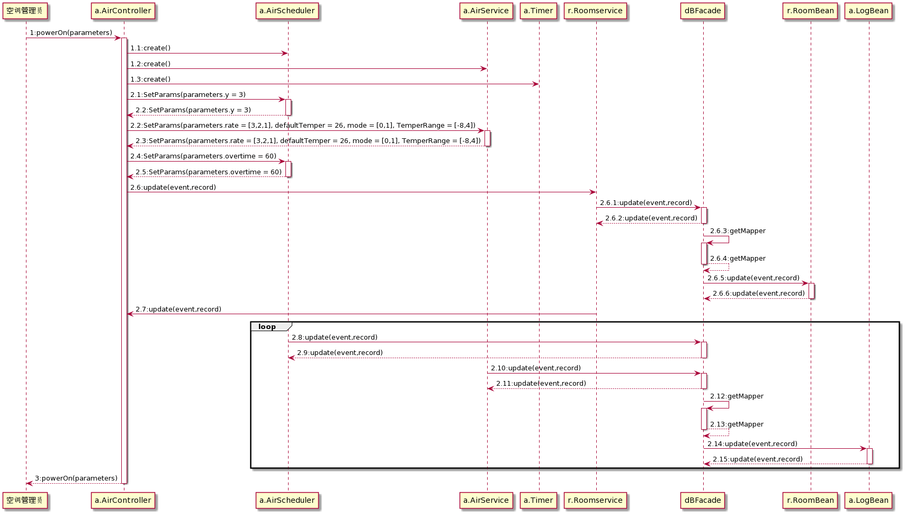
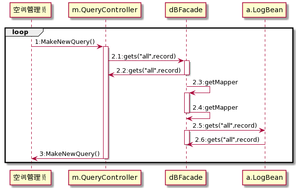

# 空调管理员动态设计

2018211037班 2018211349 罗天佑

## powerOn(int defaultRoomNum,int avoidTime)

|  操作   |  powerOn:输入参数，开启中央空调 |
|  ----  | ----  |
| 前置操作  | 空调管理员登录 |
| 后置操作  | 1.一个中央空调示例创建 2.空调实例属性被修改 3.多个房间实例与空调相关联|


### 交互图




> 空调初始化具体参数：

```JAVA
private int defaultRoomTemp;

private int tempHighLimit;

private int tempLowLimit;

private int defaultTargetTemp;

private double feeRateHigh;

private double feeRateMiddle;

private double feeRateLow;

private String defaultFunSpeed;

private int defaultRoomNum;

private int avoidTime;

private int state;

```

### 解释说明：
我们在上次作业中认为空调系统始终开机。现在进行修改，新增此用例：powerOn。

1. 创建了空调控制器，控制器创建了AirScheduler和AirService，Timer。Timer是定时器，在定时更新的时候有用，设置参数为60s。AirScheduler是调度中心，支持调度3间房。AirService是服务中心，速率，缺省温度，温度范围都进行传参。这里不做持久化是因为我们的系统中只有一个调度中心和服务中心，单独做一个数据库的表存储每次开机的设定值没有意义，这些数据存储着也没有人去查看，所以直接在内存中存储即可，下次开机的时候反正也要重新设置。因此，我们认为可以使用Redis以支持调度中心、服务中心的运行

2. m.QueryController是“manager”创建的控制器。AirSchedule调度中心和Service服务中心实时地更新空调服务和房间状态信息，并且通过dbFacade进行持久化，这是一个循环，已用loop框出，该循环直到中央空调关机才会结束。

3. 由于AirScheduler和AirService在开启后直接运行、我们认为应该通过开启新的线程来实现这两个服务，使得该函数可以正常的返回，而不是一直陷在loop循环中。
4. 用户的各种请求可以存储在Redis或是服务类的成员中，以此实现AirScheduler和AirService服务与请求间的交互。


## MakeNewQuery(@PathVariable String room_id)

|  操作   |  MakeNewQuery:输入房间号，查询该房间空调使用情况 |
|  ----  | ----  |
| 前置操作  | 中央空调开启 |
| 后置操作  |  无 |

### 交互图



### 解释说明

此协作图对应我们作业三中的MakeNewQuery()用例。

空调管理员的前端使用定时器每分钟向后端发送MakeNewQuery()，通过从数据库查询数据，获取此时房间空调使用情况。以此完成每分钟刷新一次数据。


